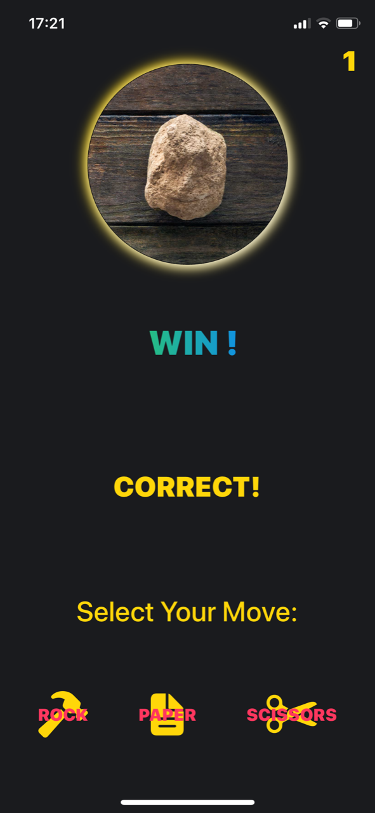
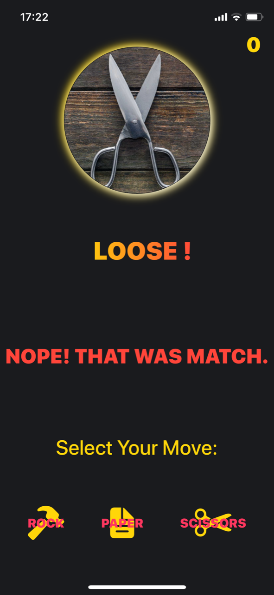

# iOS-rock-paper-scissors
iOS game - Rock-Paper-Scissors. Created using SwiftUI.

<table>
  <tr>
  <td></td>
  <td></td>
  </tr>
 </table>

Circle-shaped image displays iOs's hand-selection, with textfield prompting Player to either win or loose.

1. Tap on one of three buttons to select correct move
2. If You chose correct move, You'll get +1 point. If not, -1. (Score updates in top-right corner)
3. Tap anywhere on screen for next round
